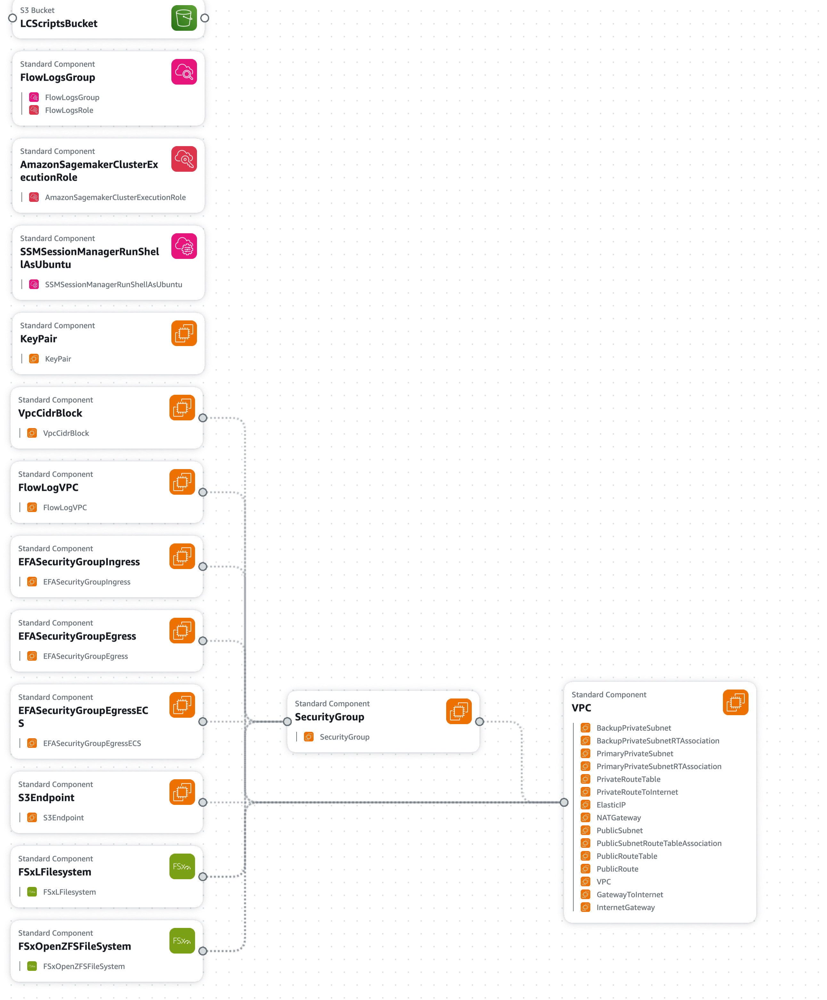
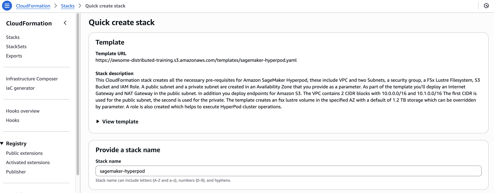

# SageMaker HyperPod Easy Setup

The Automation script will help you to create and setup of a SageMaker HyperPod Cluster with SLURM integration.

## 🪄 Infrasturcture Creation Template

Deploy a CloudFormation stack using the `sagemaker-hyperpod.yaml` template file.

### Template Overview

This YAML file is an AWS CloudFormation template for provisioning infrastructure required to run an Amazon SageMaker HyperPod cluster. It automatically creates VPC components, security groups, FSx file systems, S3 bucket, IAM roles, and optionally, an SSM Session Manager document.

The key resources created by the template include:

### **1. Networking**

- **VPC** with 2 CIDR blocks:
    - 10.0.0.0/16 for public subnet
    - 10.1.0.0/16 for private subnet
- **Subnets**:
    - Public subnet
    - Primary private subnet
    - *(Optional)* Backup private subnet (for multi-AZ setups)
- **Internet Gateway (IGW)** and **NAT Gateway**
- **VPC Flow Logs** with CloudWatch Log Group
- **S3 VPC Endpoint** *(conditional)*
  

### **2. Security**

- One Security Group for **EFA (Elastic Fabric Adapter)** communication
- Allows **all-to-all ingress and egress** within the group
- Additional egress to the internet (0.0.0.0/0)

### **3. Storage**

- **FSx for Lustre**:
    - Default 1.2 TiB (customizable)
    - Supports **LZ4 compression**, high throughput (125–1000 MB/s/TiB)
    - **Persistent_2** deployment with automatic metadata management
- **FSx for OpenZFS** *(optional)*:
    - Single-AZ HA deployment
    - Custom throughput (160–10240 MB/s)
    - NFS export with rw, no_root_squash, crossmnt
    - Backup retention & maintenance window supported

### **4. IAM and Access**

- **IAM Role for SageMaker Cluster Execution**:
    - Allows VPC-level networking operations for training jobs
    - Attached managed policy: AmazonSageMakerClusterInstanceRolePolicy
- *(Optional)* **SSM Session Manager Document**:
    - Named SSM-SessionManagerRunShellAsUbuntu
    - Configures default session user as ubuntu

### **5. S3**

- One dedicated **S3 bucket** to store lifecycle configuration scripts
- Bucket name includes random GUID suffix

---

### Deployment Methods

**[Option 1]** Log in to your AWS account and click [this link](https://console.aws.amazon.com/cloudformation/home?#/stacks/quickcreate?templateURL=https://awsome-distributed-training.s3.amazonaws.com/templates/sagemaker-hyperpod.yaml&stackName=sagemaker-hyperpod) to launch the stack via the **Quick create stack** page.

**[Option 2]** Download the  locally and manually upload it via **Create stack > With new resources (standard)**:

* provide a stack name: `sagemaker-hyperpod`

---

### Configurable Parameters

| Parameter | Default | Description |
|----------|---------|-------------|
| `VPCName` | `SageMaker HyperPod VPC` | Name of the VPC |
| `PrimarySubnetAZ` | `usw2-az4` | AZ ID for primary subnets |
| `BackupSubnetAZ` | *(empty)* | *(Optional)* AZ for backup private subnet |
| `CreateS3Endpoint` | `true` | Whether to create S3 VPC endpoint |
| `Capacity` | `1200` | FSx for Lustre capacity (GiB) |
| `PerUnitStorageThroughput` | `250` | Lustre throughput (MB/s per TiB) |
| `Compression` | `LZ4` | Compression type for Lustre |
| `LustreVersion` | `2.15` | Lustre version |
| `CreateOpenZFS` | `false` | Create FSx for OpenZFS |
| `OpenZFSThroughput` | `160` | OpenZFS throughput (MB/s) |
| `OpenZFSStorageCapacity` | `64` | OpenZFS capacity (GiB) |
| `SSMDocumentName` | `true` | Create SSM session document |

> 💡 **Note:** AZ IDs vary by region. Check [this AWS doc](https://docs.aws.amazon.com/ko_kr/ram/latest/userguide/working-with-az-ids.html) to find valid AZ IDs for your region.

---

### Output Resources After Deployment

After deployment, the stack will export the following resources:

| Output Name | Description |
|-------------|-------------|
| `VPC` | ID of the VPC |
| `PublicSubnet` | ID of the public subnet |
| `PrimaryPrivateSubnet` | ID of the primary private subnet |
| `BackupPrivateSubnet` | *(Optional)* ID of the backup private subnet |
| `SecurityGroup` | ID of the security group |
| `FSxLustreFilesystemMountname` | Lustre mount name |
| `FSxLustreFilesystemDNSname` | Lustre DNS name |
| `FSxLustreFilesystemId` | FSx for Lustre ID |
| `FSxOpenZFSFileSystemId` | *(Optional)* OpenZFS filesystem ID |
| `FSxOpenZFSFileSystemDNSname` | *(Optional)* OpenZFS DNS name |
| `AmazonSagemakerClusterExecutionRoleArn` | ARN of the IAM role |
| `AmazonS3BucketName` | S3 bucket for lifecycle scripts |

---

## 🪄 Cluster Creation Automation Script 

